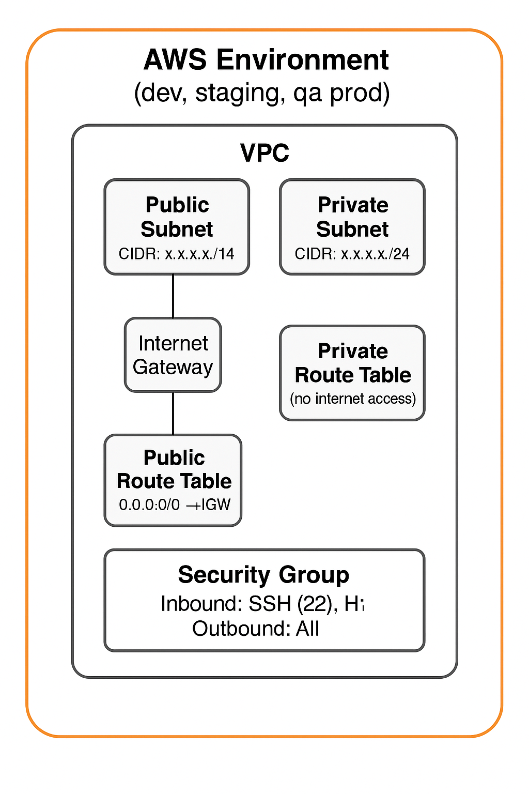
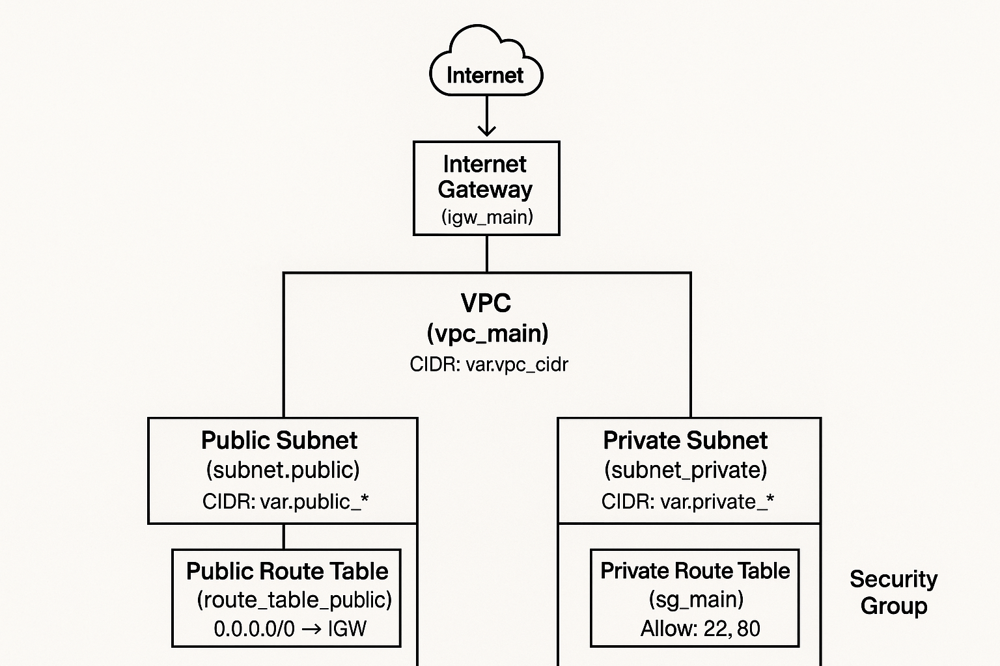

# Sample-Terraform-Creation

📘 Terraform AWS VPC Setup (Dev, Staging, QA, Prod)
This Terraform project provisions four separate VPC environments — dev, staging, qa, and prod — using a shared reusable VPC module. Each environment creates:

A dedicated VPC

One public and one private subnet

Public and private route tables

An Internet Gateway

A Security Group with basic inbound/outbound rules

📁 Project Structure
r
Copy
Edit
terraform/
│
├── modules/
│   └── vpc/
│       ├── main.tf              # VPC + subnets + routes + SG
│       ├── variables.tf         # Module inputs
│       └── outputs.tf           # Module outputs
│
├── dev/
│   └── main.tf                  # Dev environment
├── staging/
│   └── main.tf                  # Staging environment
├── qa/
│   └── main.tf                  # QA environment
└── prod/
    └── main.tf                  # Prod environment 

⚙️ What It Creates
For each environment (dev, staging, qa, prod):

VPC: With its own CIDR block

Public Subnet: Accessible to the internet

Private Subnet: Isolated, no direct internet

Internet Gateway: Attached to the VPC

Route Tables:

Public Route Table with 0.0.0.0/0 via IGW

Private Route Table (no default internet access)

Security Group: Allows inbound SSH (22) and HTTP (80), outbound all

✅ Requirements  
Terraform v1.x

AWS CLI configured with appropriate credentials

AWS IAM user with VPC, EC2, and networking permissions

🚀 How to Use
1. Clone the Repository
bash
Copy
Edit
git clone https://your-repo-url.git
cd terraform
2. Initialize and Apply (per environment)
bash
Copy
Edit
cd dev       # or staging, qa, prod
terraform init
terraform apply
💡 You can also preview changes with terraform plan.

📤 Outputs
Each environment outputs:

VPC ID

Public Subnet ID

Private Subnet ID

Security Group ID

These outputs can be used for other modules like EC2, RDS, etc.

🧠 Notes
You can customize CIDR blocks and availability zones by modifying the variables in each main.tf.

This setup uses a single AZ per VPC for simplicity. You can expand it to multiple AZs and subnets if needed.

Make sure to destroy resources in each environment when no longer needed:

bash
Copy
Edit
terraform destroy
🏗️ Architecture Diagram (Visual Aid)
See the image in the /docs folder or ask ChatGPT to generate one if you're logged in.

